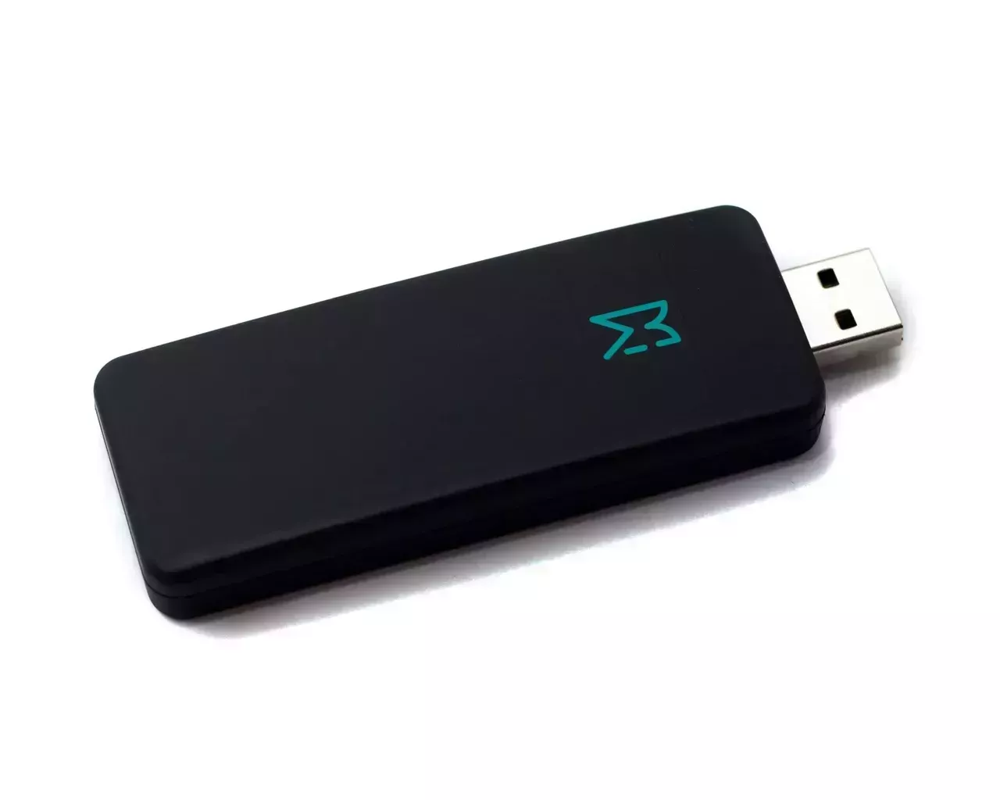

# <THeader k='domesticMotionCapture.title'/>

<T k='domesticMotionCapture.author'/>
<T k='domesticMotionCapture.originalDate'/>

---

## <THeader k='domesticMotionCapture.history.title'/>

- <T k='domesticMotionCapture.history.kinect'/> 
<Youtube v-after id="JQvLt7DQhaI" class="inline right-40 top-5 absolute" />
- <T k='domesticMotionCapture.history.vtubers'/>

- <T k='domesticMotionCapture.history.hololive'/>

---

## <THeader k='domesticMotionCapture.types.title'/>

- <T k='domesticMotionCapture.types.dof6'/>   
  - <T k='domesticMotionCapture.types.dof6_pros'/>
  - <T k='domesticMotionCapture.types.dof6_cons'/>

- <T k='domesticMotionCapture.types.imu'/> 
  - <T k='domesticMotionCapture.types.imu_desc'/> <Youtube v-after id="qh8Zxo5-7CY" class="absolute right-30" />  
    - <T k='domesticMotionCapture.types.imu_pros'/>
    - <T k='domesticMotionCapture.types.imu_cons'/>

- <T k='domesticMotionCapture.types.visual'/>  
  - <T k='domesticMotionCapture.types.visual_pros'/>
  - <T k='domesticMotionCapture.types.visual_cons'/>
---

## <THeader k='domesticMotionCapture.examples6dof.title'/>

- <T k='domesticMotionCapture.examples6dof.controllers'/>  
  - <T k='domesticMotionCapture.examples6dof.controllers_pros'/>

- <T k='domesticMotionCapture.examples6dof.lighthouse'/>  
  - <T k='domesticMotionCapture.examples6dof.lighthouse_pros'/>
  - <T k='domesticMotionCapture.examples6dof.lighthouse_cons'/>
  
- <T k='domesticMotionCapture.examples6dof.ultimate'/> 
  - <T k='domesticMotionCapture.examples6dof.ultimate_pros'/>
  - <T k='domesticMotionCapture.examples6dof.ultimate_cons'/>

---

## <THeader k='domesticMotionCapture.examples3dof.title'/>

- <T k='domesticMotionCapture.examples3dof.mocopi'/> 
  - <T k='domesticMotionCapture.examples3dof.mocopi_pros'/>
  - <T k='domesticMotionCapture.examples3dof.mocopi_cons'/>

- <T k='domesticMotionCapture.examples3dof.slime'/> 
  - <T k='domesticMotionCapture.examples3dof.slime_pros'/>
  - <T k='domesticMotionCapture.examples3dof.slime_cons'/>

- <T k='domesticMotionCapture.examples3dof.owo'/> 
  - <T k='domesticMotionCapture.examples3dof.owo_pros'/>
  - <T k='domesticMotionCapture.examples3dof.owo_cons'/>
- <T k='domesticMotionCapture.examples3dof.haitora'/> 
  - <T k='domesticMotionCapture.examples3dof.haitora_pros'/>
  - <T k='domesticMotionCapture.examples3dof.haitora_cons'/>

---

## <THeader k='domesticMotionCapture.visualExamples.title'/>

- <T k='domesticMotionCapture.visualExamples.mocap4all'/> 
  - <T k='domesticMotionCapture.visualExamples.mocap4all_pros'/>
  - <T k='domesticMotionCapture.visualExamples.mocap4all_cons'/>

- 
Amethyst (Xbox 360)
 
  - <T k='domesticMotionCapture.visualExamples.amethyst_pros'/>
- <T k='domesticMotionCapture.visualExamples.april'/> 
  - <T k='domesticMotionCapture.visualExamples.april_pros'/>
  - <T k='domesticMotionCapture.visualExamples.april_cons'/>

---

## Table

| | | | | | | | | | |
|--------------------|-----------------------|-----------------|-----------------------|----------------|-----------------------------|------------------|------------------------|-------------------------|------------------|
| Developer            | HTC                     | HTC               | Tundra                  | SlimeVR          | Shiftall                      | Sony               | Akiya Research Institute | Ju1ce, DIY                | K2VR Team          |
| Form factor          | 3x 75 g trackers        | 3x 94g trackers   | 3x 50 g trackers        | 5x 50 g trackers | 5 trackers connected by wires | 6x 8g trackers     | Various Cameras          | QR codes & central camera | Central camera     |
| Battery Life         | 7.5 h                   | 7h                | 7 h                     | 15 h             | 10 h                          | 10 h               | ∞                        | ∞                         | ∞                  |
| Tracking             | 6DoF                    | 6DoF (Inside Out) | 6DoF                    | IMU              | IMU                           | IMU                | Visual                   | Visual                    | Visual             |
| Prone to occlusion   | Yes                     | No?               | Yes                     | No               | No                            | No                 | Yes                      | Yes                       | Yes                |
| Coverage             | 360°                    | 360°              | 360°                    | 360°             | 360°                          | 360°               | 360° \*                  | 360° ²                    | 180°               |
| Precision            | < 1 mm                  | TBD (<1mm)        | < 1 mm                  | 1-10 cm ¹        | 1-10 cm ¹                     | 1-20 cm            | 1-10 cm                  | < 1 cm                    | 1-10 cm            |
| Latency              | ~15 ms                  | 15 ms             | ~15 ms                  | ~15 ms           | \>15 ms                       | 50+ ms             | 30+ ms                   | 30+ ms                    | ~20 ms             |
| Update rate          | 90-144 Hz               | Unknown (90Hz)    | 90-144 Hz               | 100 Hz           | 50-100 Hz                     | 50 Hz              | Cameras framerate        | Camera framerate          | 30 Hz              |
| Range                | 10 m                    | 10 m / Wi-Fi C.   | 10 m                    | Wi-Fi coverage   | Bluetooth coverage            | Bluetooth coverage |                          | 2-3 m                     | 2-4 m              |
| Connectivity         | 2.4Ghz (SteamVR)        | 2.4Ghz \| Wi-Fi   | 2.4Ghz (SteamVR)        | Wi-Fi            | Bluetooth                     | Bluetooth \| Wi-Fi |                          | Visual                    | Visual             |
| Can track any object | Yes                     | Yes?              | Yes                     | No               | No                            | No                 |                          | Yes                       | No                 |
| Open Source          | No                      | No                | No                      | SW + HW          | No                            | No                 |                          | SW + HW                   | SW                 |
| Price                | $390 + ~$400 Lighthouse | $600              | $360 + ~$400 Lighthouse | $195             | $270                          | $449               |                          | Printer & camera          | ~$30 (used Kinect) |

---
layout: image-right
image: "./img/mem.gif"
---
## <THeader k='domesticMotionCapture.software.title'/>
### <THeader k='domesticMotionCapture.software.weird'/>

<T k='domesticMotionCapture.software.weird_desc'/>

---

## <THeader k='domesticMotionCapture.vmc.title'/>

- <T k='domesticMotionCapture.vmc.steamvr'/>
- <T k='domesticMotionCapture.vmc.osc'/>
- <T k='domesticMotionCapture.vmc.mocopi'/>
- <T k='domesticMotionCapture.vmc.lip'/>
- <T k='domesticMotionCapture.vmc.eye'/>
- <T k='domesticMotionCapture.vmc.unity'/>
- <T k='domesticMotionCapture.vmc.unreal'/>
- <T k='domesticMotionCapture.vmc.opensource'/>

---

## <THeader k='domesticMotionCapture.vmcConnectivity.title'/>

---

## <THeader k='domesticMotionCapture.osc.title1'/>

---

## <THeader k='domesticMotionCapture.osc.title2'/>

---

### <THeader k='domesticMotionCapture.funfact.funfact_title'/>

## <THeader k='domesticMotionCapture.funfact.funfact'/>

<T k='domesticMotionCapture.funfact.funfact_desc'/>

---

## <THeader k='domesticMotionCapture.face.title'/>

- <T k='domesticMotionCapture.face.vive'/> 
  - <T k='domesticMotionCapture.face.vive_cons'/>

- <T k='domesticMotionCapture.face.livelink'/> 
  - <T k='domesticMotionCapture.face.livelink_pros'/>
  - <T k='domesticMotionCapture.face.livelink_cons'/>

- <T k='domesticMotionCapture.face.ifacial'/>
  - <T k='domesticMotionCapture.face.ifacial_pros'/>

- <T k='domesticMotionCapture.face.meowface'/>
  - <T k='domesticMotionCapture.face.meowface_pros'/>

---

## <THeader k='domesticMotionCapture.hands.title'/>

- <T k='domesticMotionCapture.hands.opengloves'/> 
  - <T k='domesticMotionCapture.hands.opengloves_pros'/>
  - <T k='domesticMotionCapture.hands.opengloves_cons'/>

- <T k='domesticMotionCapture.hands.quest'/> 
  - <T k='domesticMotionCapture.hands.quest_pros'/>
  - <T k='domesticMotionCapture.hands.quest_cons'/>

- <T k='domesticMotionCapture.hands.knuckles'/> 

- <T k='domesticMotionCapture.hands.leap'/> 

---

## <THeader k='domesticMotionCapture.ragdolls.title'/>

<Youtube id="Lbf37m2QDJY" class="h-full" />

---

## <THeader k='domesticMotionCapture.workflow.title'/> (2023)

  

  

    
Back then

    
  

  

    
Right now

    
  

  
 
    

      
      
      
    

    
  

---

## <THeader k='domesticMotionCapture.results.title'/>

<SlidevVideo v-click autoplay controls>
  <source src="./img/ExampleMotionCapture.mp4" type="video/mp4" />
</SlidevVideo>

---

## <THeader k='domesticMotionCapture.results.title2'/>

<SlidevVideo v-click autoplay controls>
  <source src="./img/idkaboutcorpseexpression.mp4" type="video/mp4" />
</SlidevVideo>
---
src: ../../slides/closing/questions.md
---

---
src: ../../slides/closing/thank-you.md
---
---
