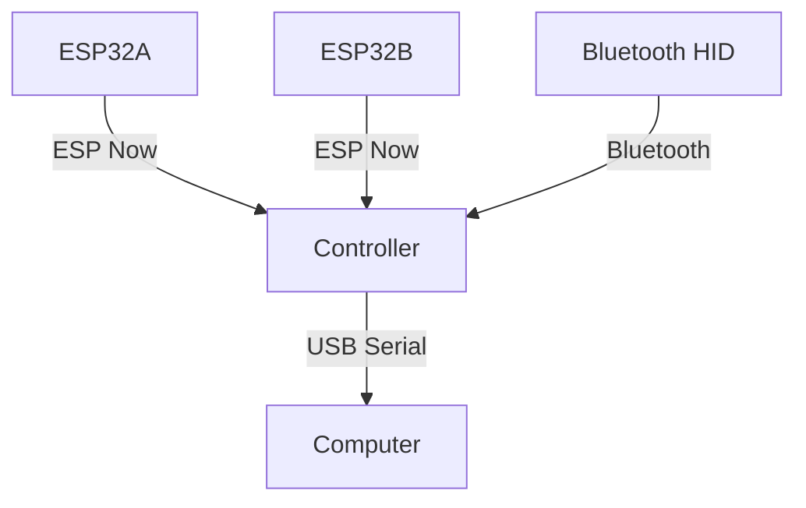

<TitleSlide />

---

## What is a Tamagochi?

- It's a virtual pet launched by 90's

---

### Okay Watson, I think everybody knows what's

## What's Actually the Tamagochi Hardware?

- A MicroController 
  - early ones: a Epson MCU E0C6S46
  - late ones: SunPlus/GeneralPlus GPLB5X MOS6502 - based [^1][]
- LCD Display
- Three Button Layout
- Speaker
- IR (Since Tamagotchi Collection)

    [^1] For more information about these  Natalie Silvanovich "Even More Tamagotchis Were Harmed in the making of the presentation"

---

### Okay, I didn't understood a shit, Could You explain in human terms

## Introduction to the MicroControllers

- A Microcontroller is a All in one Solution that includes low-power Processor, memory and storage in a small package
- It's thought mainly for repetitive, specific tasks:
  - Example:
    - Microwaves
      - Control the Input, Internal Clock, the Timer.
    - Smart Thermostats
    - Pedemeters
    - Clocks

(Nowadays are quite popular for Internet of things)

---

## What's the options If I want to make a Tamagochi right now

<!-- Ofc, now days, You can still buy microcontrollers that are way more powerful than the original tamagochis MicroControllers.
You take in mind, The Tamagochi ones are known as Integrated Microcontrollers. (The Microcontroller + thingies)
The choice of the microcontroller determine the limits of the complexity the game.  -->
  

- ESP-32
  - Xtensa CPU (S3 are ideal for 2D Image Tansform and Video Playback... poorly)
  - RISC-V CPU (Quite cheap)
- NXP (Power, ARM)   

- STM32 (ARM Cores)
- Raspberry Pi Pico
- Arduino

---

## What's the options If I want to make a Tamagochi right now

### Integrated MicroControllers Manufacturer:

- Waveshare 
- LILYGO 
- M5 Stack 
- Adafruit 

---

## Language Supported:

### Programming Language Supported

  
  

### Graphics Library Standards

  
  
  

---

### cool, What kind of games can I make with these thingies

## Game Design applied to MicroControllers (1)

- Standalone
  - Tamagochi
  - Nintendo Game & Watch (Sharp SM510, NEC uCom-43)
  

  
    
  
  
  
  
 <!-- https://www.youtube.com/watch?v=Rwp9Mqwu8zs -->
  
  

- Companion Device
  - GBA (with GameCube Mode) - Dumb Terminals 
  - PSP (With PS3) - Resistance Retribution
  - VMU (Dreamcast)
  - PokeWalker
- Accessories
  - Guitar Hero Controller

---

###

## Game Design applied to MicroControllers (2)

---

### How can I connect all this shit

## Networking

---
