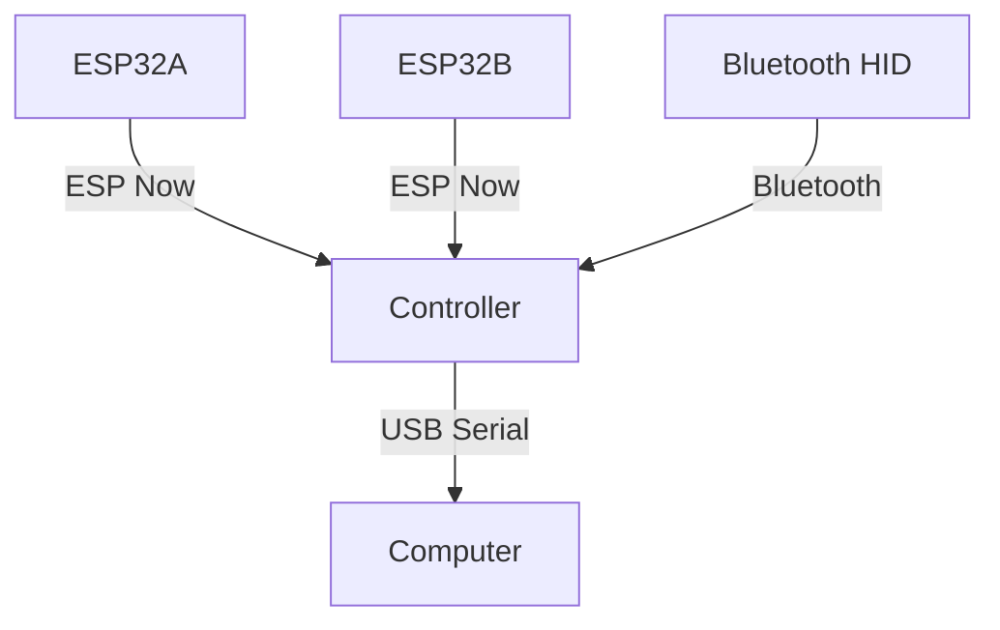

<TitleSlide />

---

## What is a Tamagochi?

- It's a virtual pet launched by 80's

---

### Okay Watson, I think everybody knows what's
##  What's Actually the Tamagochi Hardware?

- A MicroController
    -  early ones: a Epson MCU E0C6S46
    -  Late ones: SunPlus/GeneralPlus GPLB5X MOS6505 based

- Thanks to Natalie Silvanovich to the Details (This is rare documented device despite which popular is)

---

### Okay, I didn't understood a shit, Could You explain in human terms
## Introduction to the MicroControllers

- A Microcontroller is a mini processor that is designed to a small task undefintly.
- It's thought mainly for long tasks that require
    - Example: 
        - Microwaves
            - Control the Input, Internal Clock, the Timer.
        - Somoe 

(Nowadays are quite popular for Internet of things)

---

## What's the options If I want to make a Tamagochi right now.

Ofc, now days, You can still buy microcontrollers that are way more powerful than the original tamagochis MicroControllers.
You take in mind, The Tamagochi ones are known as Integrated Microcontrollers. (The Microcontroller + thingies)
The choice of the microcontroller determine the limits of the complexity the game.  

- ESP-32 
    - Xtensa CPU (S3 are ideal for 2D Image Tansform and Video Playback... poorly)
    - RISC-V CPU (Quite cheap)
- NXP
- STM32

---

### cool, What kind of games can I make with these thingies.
## Game Design applied to MicroControllers (1) 

- Standalone
    - Tamagochi 
    - Nintendo Game & Watch (Sharp SM510, NEC uCom-43)
- Companion Device
    - GBA (with GameCube Mode) - Dumb Terminals
        - Windwaker
    - VMU (Dreamcast)
    - PokeWalker
- Accessories
    - PSP (connected with PS3)
    - Guitar Hero Controller 

---

### 
##  Game Design applied to MicroControllers (2) 

---

### How can I connect all this shit
## Networking

--- 
