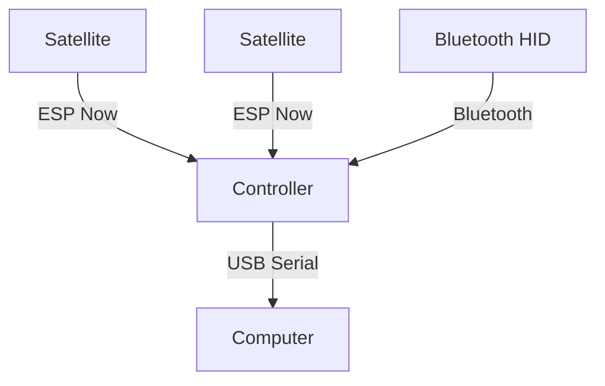

<TitleSlide />

---

## <THeader k='microcontrollers.why' />

<Youtube v-click id="fMQwZRW1wng" class="h-full w-full" />

---

### <THeader k='microcontrollers.explanationQuestion' />

## <THeader k='microcontrollers.introduction' />

- <T k='microcontrollers.definition' />
- <T k='microcontrollers.specificTasks' />
  - <T k='microcontrollers.examples' />
    - <T k='microcontrollers.microwaves' />
      - <T k='microcontrollers.microwaveControls' />
    - <T k='microcontrollers.smartThermostats' />
    - <T k='microcontrollers.pedemeters' />
    - <T k='microcontrollers.clocks' />
<T k='microcontrollers.iot' />

---

## <THeader k='tamagotchi.whatIs' />

- <T k='tamagotchi.bandai' /> 
- <T k='tamagotchi.care' />
- <T k='tamagotchi.realTimeClock' />
  - <T k='tamagotchi.hungry' />
  - <T k='tamagotchi.happiness' />
  - <T k='tamagotchi.training' />
  - <T k='tamagotchi.sickness' />
- <T k='tamagotchi.lifeCycle' />

---

### <THeader k='tamagotchi.hardwareJoke' />

## <THeader k='tamagotchi.hardwareTitle' />

- <T k='tamagotchi.microcontroller' /> 
  - <T k='tamagotchi.earlyModels' />
Epson MCU E0C6S46/48 [^1][]

  - <T k='tamagotchi.lateModels' />
 SunPlus/GeneralPlus GPLB5X MOS6502 - based [^2][]

- <T k='tamagotchi.lcd' />
- <T k='tamagotchi.buttons' />
- <T k='tamagotchi.speaker' />
- <T k='tamagotchi.ir' />

    
[^1] https://github.com/jcrona/tamalib/#hardware-information

    
[^2] For more information about these  Natalie Silvanovich "Even More Tamagotchis Were Harmed in the making of the presentation"

---

## <THeader k='microcontrollers.currentOptions' />

<!-- Ofc, now days, You can still buy microcontrollers that are way more powerful than the original tamagochis MicroControllers.
You take in mind, The Tamagochi ones are known as Integrated Microcontrollers. (The Microcontroller + thingies)
The choice of the microcontroller determine the limits of the complexity the game.  -->
  

- ESP-32
  - Xtensa CPU (S3 are ideal for 2D Image Tansform and Video Playback... poorly)
  - RISC-V CPU (Quite cheap)
- NXP (Power, ARM) 
- STM32 (ARM Cores)
- Raspberry Pi Pico
- Arduino

---

## <THeader k='microcontrollers.currentOptions' />

### <THeader k='microcontrollers.oldschool' />

### <THeader k='microcontrollers.integrated' />

- Waveshare
- LILYGO
- M5 Stack
- Adafruit

---

## <THeader k='languages.supported' />

### <THeader k='languages.programming' />

  
  

### <THeader k='languages.graphicsLibraries' />

  
  
  

---

### <THeader k='gameDesign.whatCanIDo' />

## <THeader k='gameDesign.microcontroller' />

- <T k='gameDesign.standalone' />

  
  - Tamagotchi
  - Nintendo Game & Watch (Sharp SM510, NEC uCom-43)
  

  
    

  

  

  

  

- <T k='gameDesign.companionDevice' />

  - GBA (with GameCube Mode) - Dumb Terminals
  - PSP (With PS3) - Resistance Retribution
  - VMU (Dreamcast)
  - PokeWalker

  
- <T k='gameDesign.accessories' />

  - <T k='gameDesign.rhythmAccessories' />
  - 

---

### **CutreGotchi**

## <THeader k='useCases.accessories1' />

- LVGL
- Waveshare ESP32-S3-Touch-LCD-1.85
- Display: 360 × 360 pixels (262K colors)
  - Touch Panel: Capacitive touch controlled via I2C
  - QMI8658 6-axis gyroscope and accelerometer
  - Onboard audio decoding chip with built-in microphone and speaker support

  
  

---

### **Castanets ESP32**

## <THeader k='useCases.accessories2a' />

- A Controller 
  - EspressIf ESP32-S3 (Xtensa) N8R8
  - Connectability: ESP-NOW, USB-Serial

  
  

- Satellites 
  - ESP32-C3 & ESP32-C6 (RISC-V) 
  - Connectability: ESP-NOW
  - GPIO 
    - (for Piezo)

  

---

## <THeader k='useCases.accessories2b' />

### **Mercacompra 2030**

https://geri8.itch.io/mercacompra2030

---

## <THeader k='useCases.companion3a' />

### <THeader k='useCases.treasureRadar' />

  
  
  

---

## <THeader k='useCases.companion3b' />

### <THeader k='useCases.cooperativeGame' />

  
  
  
  

---

## <THeader k='tamagotchi.canUseMicrocontroller' />

### <THeader k='tamagotchi.ofCourse' />

---
src: ../../slides/closing/questions.md
---

---
src: ../../slides/closing/thank-you.md
---

---
layout: image
background: ./img/CGD_bg.jpg
image: ./img/CGD_bg.jpg
---

# <T k='closing.oneMoreThing' />

## Proxima Meetup

- [Jose Escribano](https://www.mobygames.com/person/567289/jose-antonio-escribano-ayllon/) Vuelve

- [Rubus / @KaruArts](https://www.artstation.com/karuarts) Saca nuevo Juego 
  - Charla: "Porqué siempre debes hacer caso a esa vocecilla de tu cabeza y comprobar que el trademark esté libre en vez de fiarte del resto del equipo para evitar problemas legales que te impidan sacar el puto que lleva hecho un par de meses porque un cryptobro mamahuevos te da problemas"

- [Una Posibilidad](https://www.mobygames.com/person/909352/alejo-silos-leal/)

